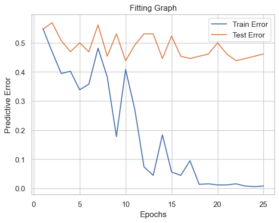

# The Impact of News on Stock Market Predictions: Analyzing and Predicting S&P 500 with News Headlines
## Before reading further
Our project is [**hosted live here**](https://aaron3963.github.io/CSE_151A_Project/), which integrated all the `README` info into our project notebook. It is guaranteed a better reading experience there!
## Introduction
Stock trading, as a critical component of the modern economic framework, profoundly impacts almost every aspect of our daily lives. The stock market itself serves as a vital barometer of economic trends, 
reflecting the trajectories of companies, regions, nations, and even the global economy. Stock prices fluctuate every second, with international news often playing a significant role in these changes. 
In the past, people relied on newspapers to deliver information on which to base their stock decisions, but today, information is transmitted instantaneously via social media, online articles, and especially news stations.

In this project, we aim to train a model capable of predicting the rise or fall of the S&P 500 index immediately upon receiving news headlines. 
This tool can empower individuals to make more informed financial decisions, even if they lack expertise in the relevant industry or region covered by the news. 
For this purpose, we collected daily news headlines from CNBC, The Guardian, and Reuters from 2018 to 2020, along with daily trading data for the S&P 500 during the same period.


## Methods
### Exploratory Data Analysis (EDA)

#### News Headlines Dataset

The three news datasets are obtained through [Kaggle](https://www.kaggle.com/datasets/notlucasp/financial-news-headlines/data). The author mentioned these data are scraped from CNBC, the Guardian, and Reuters official websites, the headlines in these datasets reflects the overview of the U.S. economy and stock market every day for the past year to 2 years.

The Timeframes of data:

- Data scraped from CNBC contains the headlines, last updated date, and the preview text of articles from the end of `December 2017` to `July 19th, 2020`.
- Data scraped from the Guardian Business contains the headlines and last updated date of articles from the end of `December 2017` to `July 19th, 2020` since the Guardian Business does not offer preview text.
- Data scraped from Reuters contains the headlines, last updated date, and the preview text of articles from the end of `March 2018` to `July 19th, 2020`.


We can see here that all of the news datasets have varying numbers of data points ranging from 2800 to 32700. This will not be a problem for us since our question focuses on the impact of news headlines in general on the S&P 500, so all of this data will be combined in to a larger dataset ordered by the date of the headline. The difference between the number of headlines by CNBC and the other news stations is explained by the fact that much of the data is null.

##### Headline Length


These histograms display the number of headlines given a specific length. Analysis of headline lengths revealed that most headlines range from 60-70 words, with maximum lengths of 100 words for CNBC and Reuters, and 120 words for The Guardian.

##### Headline Distribution

To find out the distribution of headlines throughout the time frame, we generated a graph with headlines colored differently in each month of the year. 

These graphs depict the number of headlines per month per year. With this, we can see that the earlier months of the year seem to have a higher concentration of headlines. Note that CNBC and Guardian data begins late December of 2018 to early 2019 compared to Reuters which begins in early 2018. While this won't cause any direct issues since all datasets will be combined, it must be noted that the 2018 data is dominated completely by a single news source which could be a source of bias. 

##### Word Frequency

A short analysis on word frequency. We used the stopword dictionary in `nltk` to help filter out words like `a` and `the`.


Most of the words are meaningful, but who is `cramer` in the CNBC dataset? Turns out [Jim Cramer](https://en.wikipedia.org/wiki/Jim_Cramer) is the host of various financial programs on CNBC. We will prune him out from the CNBC dataset later.

Further analysis identified the most frequently used words in the headlines. A histogram of word occurrences revealed notable terms such as fears, energy, government, 
China, and shares, while common filler words (e.g., articles, prepositions, pronouns) were excluded from the visualization for clarity.
A short analysis of word frequency. We used the stopword dictionary in nltk to help filter out words like a and the.


#### S&P 500 Trading Dataset

##### Statistical Analysis

|  | High | Low | Close | Volume |
| --- | --- | --- | --- | --- |
| count | 669.000000 | 669.000000 | 669.000000 | 6.690000e+02 |
| mean | 2883.568308 | 2849.033738 | 2867.277964 | 3.965081e+09 |
| std | 198.117998 | 206.057495 | 202.285824 | 1.154337e+09 |
| min | 2300.729980 | 2191.860107 | 2237.399902 | 1.296530e+09 |
| 25% | 2739.189941 | 2709.540039 | 2724.439941 | 3.300220e+09 |
| 50% | 2856.669922 | 2825.389893 | 2843.489990 | 3.635780e+09 |
| 75% | 2999.149902 | 2970.090088 | 2984.870117 | 4.156640e+09 |
| max | 3393.520020 | 3378.830078 | 3386.149902 | 9.053950e+09 |

The S&P 500 dataset, spanning December 1, 2017, to July 31, 2020, includes 669 daily records with no missing values. The dataset contains columns for High, Low, Close, and Volume. Key summary statistics are as follows:
	•	Average prices: High (2883), Low (2849), and Close (2867),
	•	Standard deviations: approximately 200 points, indicating moderate volatility,
	•	Average daily trading volume: 3.97 billion shares, ranging from 1.3 billion to 9.05 billion shares, reflecting spikes in market activity during major events.

To prepare for analysis, normalization or standardization may be beneficial to handle the scale differences, particularly between price and volume data. This initial overview confirms a relatively stable daily distribution, setting up further analysis on trends, volatility, and potential event impacts on S&P 500 performance.

##### Close Price over Time


This is the stock price of the S&P 500 over min and max dates covered by the news headlines. One noticeable feature that is included in this graph is the large dip during early 2020 caused by COVID-19. This will have an interesting impact on our model since the news did play a big role in the scare factor for COVID-19, but the fact that it was caused by a global epidemic may skew the embeddings of other words.

### Data Preprocessing

Clean out `NaT` values in `Time` column of three datasets.

#### Cleaning Text

Here we did our first cleaning by converting all characters to lowercase and removing extra spaces, quotation marks, and other unwanted ones. We are also removing `Jim Cramer`, as well as his show `Mad Money` from the CNBC dataset.

|  | Headlines | Time | Description |
| --- | --- | --- | --- |
| 0 | a better way to invest in the covid-19 vaccine... | 2020-07-17 19:51:00 | host recommended buying four companies that ar... |
| 1 | cramers lightning round i would own teradyne | 2020-07-17 19:33:00 | host rings the lightning round bell which mean... |
| 3 | cramers week ahead big week for earnings even ... | 2020-07-17 19:25:00 | well pay more for the earnings of the non-covi... |
| 4 | iq capital ceo keith bliss says tech and healt... | 2020-07-17 16:24:00 | keith bliss iq capital ceo joins closing bell ... |
| 5 | wall street delivered the kind of pullback ive... | 2020-07-16 19:36:00 | look for the stocks of high-quality companies ... |

#### Add Prediction Target

Since our goal is to relate news outlets with S&P 500, part of our project will be focusing on the trend prediction of future S&P 500 price change. Which we created a binary column `trend_up` which will be `True` if the price current trading date is lower than tomorrow’s.

|  | Date | Close | trend\_up |
| --- | --- | --- | --- |
| 0 | 2017-12-01 | 2642.219971 | False |
| 1 | 2017-12-04 | 2639.439941 | False |
| 2 | 2017-12-05 | 2629.570068 | False |
| 3 | 2017-12-06 | 2629.270020 | True |
| 4 | 2017-12-07 | 2636.979980 | True |

We also want to ensure that the proportions `True` and `False` are balanced.


#### Set Time Granularity

Though some of the datasets have timestamps with minute-wise precisions, we only want to research on a daily basis.

#### Concatenate 3 New Datasets

For our first model, we will ignore temporal relationships by treating every piece of news as an independent data point. We merged all datasets into one, along with the prediction target.

|  | Headlines | Description | Date | Close | trend\_up | Source |
| --- | --- | --- | --- | --- | --- | --- |
| 0 | a better way to invest in the covid-19 vaccine... | host recommended buying four companies that ar... | 2020-07-17 | 3224.729980 | True | CNBC |
| 1 | cramers lightning round i would own teradyne | host rings the lightning round bell which mean... | 2020-07-17 | 3224.729980 | True | CNBC |
| 2 | cramers week ahead big week for earnings even ... | well pay more for the earnings of the non-covi... | 2020-07-17 | 3224.729980 | True | CNBC |
| 3 | iq capital ceo keith bliss says tech and healt... | keith bliss iq capital ceo joins closing bell ... | 2020-07-17 | 3224.729980 | True | CNBC |
| 4 | wall street delivered the kind of pullback ive... | look for the stocks of high-quality companies ... | 2020-07-16 | 3215.570068 | True | CNBC |

### Base Model

We are using logistic regression with TF-IDF features as our base model.

#### Individual Headline Model

For this model, we are treating every news item as individual data points. This is guarantee to fail because there is way to little information contained in a single news title, and there will be too much noise.

Test Accuracy: 0.5147572199301809  
Train Accuracy: 0.5766158891357241  
Report on test dataset:

|  | precision | recall | f1-score | support |
| --- | --- | --- | --- | --- |
| False | 0.443804 | 0.033861 | 0.062921 | 4548.000000 |
| True | 0.517461 | 0.960652 | 0.672614 | 4905.000000 |
| accuracy | 0.514757 | 0.514757 | 0.514757 | 0.514757 |
| macro avg | 0.480633 | 0.497257 | 0.367768 | 9453.000000 |
| weighted avg | 0.482023 | 0.514757 | 0.379281 | 9453.000000 |

#### Joint Headline Model

By joining all headlines of the same day into one sentence, we hope that TF-IDF could capture more information than our previous model.

|  | Date | Headlines | trend\_up |
| --- | --- | --- | --- |
| 0 | 2017-12-18 | france saves marquis de sades 120 days of sodo... | False |
| 1 | 2017-12-19 | house prices to fall in london and south-east ... | False |
| 2 | 2017-12-20 | hedge funds fail to stop billion-dollar brain ... | True |
| 3 | 2017-12-21 | guardian brexit watch brexit helped push down ... | False |
| 4 | 2017-12-22 | says owning too many stocks and too little cas... | False |

Test Accuracy: 0.5461538461538461  
Train Accuracy: 0.6421663442940039  
Report on test dataset:  

|  | precision | recall | f1-score | support |
| --- | --- | --- | --- | --- |
| False | 0.333333 | 0.035088 | 0.063492 | 57.000000 |
| True | 0.556452 | 0.945205 | 0.700508 | 73.000000 |
| accuracy | 0.546154 | 0.546154 | 0.546154 | 0.546154 |
| macro avg | 0.444892 | 0.490147 | 0.382000 | 130.000000 |
| weighted avg | 0.458623 | 0.546154 | 0.421201 | 130.000000 |

We also experimented with the amount of features that TF-IDF should have to achieve the best performance.


As expected, we do not need too high complexity for TF-IDF, as increasing it will overfit our training dataset. A complexity of around 800 yields the best result on the test set with an accuracy of about 55%.

### Transformer Model[](https://aaron3963.github.io/CSE_151A_Project/#transformer-model)

We will be using our joined dataset which concatenates all news on the same day to one line. The main reason for this is that if we use single data news data points, there will be too much noise in our dataset, and the model cannot learn any features. Notice that `shuffle` is set to `False` in our split. This is because the stock and news data are all time-series, which we cannot inform our model about the future.


#### Preparation

We used a tokenizer from HuggingFace, which gives unique tokens to every word.

The `Dataset` class to create PyTorch’s data loader.


The module is a custom classifier from PyTorch. We will be utilizing the `TransformerEncoderLayer`, as our prediction class is only using the encoder. After the encoder, we added a fully connected layer so the output will be `num_output` of `logits`.

Below are some helper methods for calculating evaluation metrics and graphs.


#### Base Classifier Transformer Model
To start, we are using the following hyperparameters.
```
MAX_LENGTH = 600
BATCH_SIZE = 16
EMBED_DIM = 128
NUM_HEAD = 4
NUM_LAYER = 6
NUM_OUTPUT = 2
EPOCHS = 25
LEARNING_RATE = 1e-4
```
```
Epoch [5/25], Loss: 0.6124, Train Acc: 0.6615, Test Acc: 0.5000
Epoch [10/25], Loss: 0.5535, Train Acc: 0.5919, Test Acc: 0.5615
Epoch [15/25], Loss: 0.5094, Train Acc: 0.9439, Test Acc: 0.4769
Epoch [20/25], Loss: 0.3591, Train Acc: 0.9884, Test Acc: 0.5000
Epoch [25/25], Loss: 0.3440, Train Acc: 0.9923, Test Acc: 0.5385
```



As we can tell, the test accuracy is around 50%, which means the model did not learn anything useful and ended up guessing randomly. We are not using a model that does nothing more than just coin-flipping, so we did more hyperparameter tunning.

#### Changing to Singular Class

Since we are doing binary classification, there is no need for the output to be two classes, we can just merge it into one class.

```
Epoch [5/25], Loss: 0.7740, Train Acc: 0.5629, Test Acc: 0.5538
Epoch [10/25], Loss: 0.7029, Train Acc: 0.6402, Test Acc: 0.4923
Epoch [15/25], Loss: 0.6256, Train Acc: 0.6983, Test Acc: 0.5000
Epoch [20/25], Loss: 0.6154, Train Acc: 0.7737, Test Acc: 0.4769
Epoch [25/25], Loss: 0.6474, Train Acc: 0.8162, Test Acc: 0.5231
```


#### Removing Stop Words

```
Epoch [5/25], Loss: 0.7025, Train Acc: 0.5725, Test Acc: 0.6154
Epoch [10/25], Loss: 0.6257, Train Acc: 0.6518, Test Acc: 0.6231
Epoch [15/25], Loss: 0.5229, Train Acc: 0.6905, Test Acc: 0.6000
Epoch [20/25], Loss: 0.7097, Train Acc: 0.7079, Test Acc: 0.6077
Epoch [25/25], Loss: 0.5669, Train Acc: 0.7427, Test Acc: 0.6077
```


#### Removing Specific Words (remix, cramers lightning round)

```
Epoch [5/25], Loss: 0.6566, Train Acc: 0.5725, Test Acc: 0.5385
Epoch [10/25], Loss: 0.6646, Train Acc: 0.5977, Test Acc: 0.5692
Epoch [15/25], Loss: 0.6579, Train Acc: 0.6170, Test Acc: 0.5615
Epoch [20/25], Loss: 0.7210, Train Acc: 0.6480, Test Acc: 0.5692
Epoch [25/25], Loss: 0.5859, Train Acc: 0.7292, Test Acc: 0.5462
```


#### Increasing number of heads
These are the new hyperparameters compared to the base model:
```
MAX_LENGTH = 300
BATCH_SIZE = 32
EMBED_DIM = 256
NUM_HEAD = 16
NUM_LAYER = 4
NUM_OUTPUT = 1
EPOCHS = 25
LEARNING_RATE = 1e-5
```

```
Epoch [5/25], Loss: 0.6907, Train Acc: 0.5706, Test Acc: 0.5538
Epoch [10/25], Loss: 0.7336, Train Acc: 0.6499, Test Acc: 0.5077
Epoch [15/25], Loss: 0.7047, Train Acc: 0.7060, Test Acc: 0.5385
Epoch [20/25], Loss: 0.5875, Train Acc: 0.7776, Test Acc: 0.5077
Epoch [25/25], Loss: 0.6778, Train Acc: 0.8472, Test Acc: 0.4769
```


#### Increasing Number of Heads with LR Decay


```
Epoch [5/25], Loss: 0.6720, Train Acc: 0.6054, Test Acc: 0.4923
Epoch [10/25], Loss: 0.6274, Train Acc: 0.6190, Test Acc: 0.5231
Epoch [15/25], Loss: 0.7014, Train Acc: 0.6402, Test Acc: 0.5000
Epoch [20/25], Loss: 0.6835, Train Acc: 0.6422, Test Acc: 0.5077
Epoch [25/25], Loss: 0.5104, Train Acc: 0.6499, Test Acc: 0.5077
```


#### Conclusion and Best Model

Our best results happened to be 60% accuracy when we removed stop words. Usually, for context analysis, we should not remove stop words, but it may be that stop words in news headlines are uninformative compared with other words.

```
Total Samples: 517.
Correct: 273, True Positive: 238, True Negative: 35. 
False Positive: 194, False Negative: 50.
```

Our model did relatively well on predicting, with very few false negatives, which we can take advantage of it.

## Results

### Performance Summary of Models

We evaluated multiple machine learning models to predict the daily movement of the S&P 500 index based on news headlines. The table below summarizes the training and testing accuracies of the models used in this study:

| **Model**                                     | **Train Accuracy (%)** | **Test Accuracy (%)** |
|-----------------------------------------------|-------------------------|------------------------|
| Logistic Regression (TF-IDF, Individual Headlines) | 57.7                   | 51.5                  |
| Logistic Regression (TF-IDF, Joint Headlines)      | 64.2                   | 54.6                  |
| Transformer Classifier (Baseline)                  | 66.2                   | 50.0                  |
| Transformer Classifier (Single Class Output)       | 81.6                   | 52.3                  |
| Transformer Classifier (Stop Word Removal)         | 74.3                   | 61.5                  |
| Transformer Classifier (Removing Specific Words)   | 72.9                   | 54.6                  |
| Transformer Classifier (Increased Heads)           | 84.7                   | 47.7                  |
| Transformer Classifier (Increased Heads + LR Decay)| 65.0                   | 50.8                  |

### Model Performance Analysis

The Logistic Regression model with TF-IDF features served as a baseline for our analysis. Performance improved when headlines were aggregated daily rather than analyzed individually. This finding highlights the importance of incorporating richer contextual information to improve predictions.

Transformer-based models demonstrated varied performance based on preprocessing and hyperparameter tuning. The Transformer Classifier with stop word removal achieved the highest test accuracy of **61.5%**, showcasing the significance of reducing noise in textual data. However, the other configurations of Transformer models, such as increasing the number of attention heads or applying learning rate decay, failed to generalize effectively, often resulting in overfitting.

Overall, while some models outperformed random guessing, the relatively modest accuracy highlights the challenges inherent in predicting stock market movements based solely on news headlines. These results reflect the complexity of financial markets, which depend on multiple interrelated factors beyond news sentiment.


## Discussion
### Model Progression
During this discussion, we will consider 55.7% as the barrier between a model learning or underfitting since this is the accuracy the model can obtain by returning true no matter the input data. 

#### Logistic Regression
We started with this model to serve as a simple base model to compare to. The reason is that both logistic regression and TF-IDF serve as a basic methodology within classification problems and NLP respectively. TF-IDF is an effective strategy within recommender systems since it searches for occurrences; however, it does not perform well when given news headline data. A reason for this can be attributed to TF-IDF being a static model having no sense of temporal data which, in this case, is highly important. Not only that, but these types of models are not learning the sentiment of words which is a key pain point for specifically news headlines since they are crafted to take advantage of word sentiment. Although both iterations of the base model perform below the 55.7% barrier signifiying underfitting, it is important to note that the combined headlines resulted in better accuracies due to the increase in word data per entry. This combined dataset is what is used going forward in future models. 

#### Transformer
The transformer model was chosen as the main second model because of the two glaring weaknesses seen by the TF-IDF models: temporal context and learning word sentiment. By using attention and positional embeddings, transformers are able to view a collection of words as a sentence with order and create weights that reflect the sentiment of the word based on how it was used in the sentence. These reasons were the driving motivation behind using the transformer model and its following iterations.

The base transformer model has a higher train accuracy but a lower test accuracy than than the training models. This indicates that the model is both under and overfitting to the data and performs much worse than the 55.7% barrier. To combat specifically the underfitting in the test data, we simplified the number of output classes to just one. Since we are doing binary classification, there is no need for the output to be two classes, so we can merge it into one class. This marginally improved our test accuracy but caused the overfitting in the train data to worsen. 

For the next set of iterations, our main goal was to counter underfitting, but the issue of overfitting was still being considered. For context in this iteration, transformers have a major problem with dealing with noise since the sentiment of a word is impacted by all the words that preceded it. It is difficult to completely find and weed out all noise from a dataset but one large step that we took was the removal of stop words. Stop words in NLP are words that generally contain no semantic information like "a", "an", "the", "he", etc. Removing these words helps the model focus on the words that do contain semantic information and prevent their weights from being diluted. The performance of this model completely overshadowed the previous transformer and base models with a test accuracy of 61.5% and it even addressed the overfitting issue in the training data bringing the accuracy down to 74.3%. Following the same thought process, we found the word "remix", left over from a previous preprocessing step, and "cramers lightning round" that was missed while removing "cramer". After the removal of these phrases, we actually see a decrease in performance within the model in both the test and train data. Our explanation of this centers around Jim Cramer. Cramer's lightning round is a segment on CNBC's Mad Money, where Jim Cramer rapidly answers viewers' questions about stocks. While the name of the show itself may not hold any semantic meaning, which was the reason for removal, in reality, it could be very impactful in reassuring consumer attitudes about the market. Therefore a possible correlation is that when this segment is aired consumers feel better about investing in the market which in turn increases the likelihood of the market going up for the next day.

The final set of transformer iterations focuses on ensuring that the model is learning the sentiment information of the words. Since the models were not able to generalize the sentiment information in the training data to the testing data, we experimented with the addition of heads within the self-attention layers. While it did boost the accuracy of the training data, it was still unable to generalize the information it gained from training to the testing data. During this process, we found that the testing accuracy was highly volatile. To combat this, we added a decay on the learning rate so that once the model found a minima, it could stay there rather than completely blow up. Compared to the transformer model with more heads, it was able to both counter the underfitting and overfitting problem slightly; however, now the model performs similarly to the base model with no improvements. It could be the case that the increase and heads and LR decay are counteracting each other such that it results in essentially the base model, but more testing must be done to report a conclusive explanation.   

Overall, the issue of whether a model was learning was a large problem. For all models, except the transformer with stop word removal, we believe that they were not learning. This is due to a combination of factors that were already explained like incompatibility with the data, noise within the data, and more that we are not aware of. Considering that these models were either below or very close to the 55.7% threshold, it's hard to argue that the model was able to learn anything. However, the transformer with stop word removal was able to clear this barrier by 5%. Although this may not seem like a large increase, it must be put in the context of the problem. The stock market is highly volatile, those who attempt to generate money off of it look at information from a plethora of sources. News headlines, company performance, consumer attitude, the current political climate, and much more are all factors that guide investors in making their decisions. Considering the transformer model with stop word removal was able to beat the 55.7% threshold by 5%, is a strong indicator of learning, but specifically in the negative context. Looking at the graph presented in the next section, we see that this model does make the "true" prediction in most cases, but the indication of the model learning is apparent when it was able to understand when to predict "false" to get that 5% difference. 

### Quantitative Trading Strategy

Before we make our strategy, let us visualize how our best model (Transformer with stop words removed) performs on the training dataset.


From the graph above, we know that most of the time our model is predicting `True`. We can utilize it because, from our previous section, we know that our model has very few false negatives, so we can be certain that most of the time the model can predict upcoming downfalls of the index. So we can make our strategy as the following:

- Hold until model predicts bear market
- When we detect bears, sell `80%` and do a short with the revenue for 3 days

We simulated our strategy on the test dataset. We used [Vanguard’s S&P500 ETF (VOO)](https://investor.vanguard.com/investment-products/etfs/profile/voo#overview) as our target since ETFs reflects the asset with very short lags, which is enough as we are not doing high-frequency trading.


We deploy our strategy and compare it with a base strategy of holding the ETF for the entry time. And the results are the following:
 - Portfolio is `111.7785%` after half a year.  
 - Long holding is `97.8522%` after half a year.  


The conclusion is that our portfolio with this quant strategy surpassed the base strategy significantly. We got 10% gross profit within 6 months, which in our base strategy, was hard to maintain. 

### Summary

Initially, we believed news sentiment combined with market data would be a strong predictor. Early efforts, like the TF-IDF-based model, set a baseline but highlighted the limitations of simple feature extraction. The Transformer classifier offered modest improvements, achieving a `61.5%` test accuracy after tuning. However, the gains were incremental, suggesting the model struggled with the high noise and complexity inherent in financial data.

One major challenge was the dataset itself. Stock movements depend on a mix of news, macroeconomic factors, and investor behavior, making it difficult for any single model to perform well. Additionally, the binary classification approach may have oversimplified the problem. A regression model could provide more nuanced predictions, reflecting the continuous nature of market changes.

Our results are moderately believable—they outperform random guessing but remain far from reliable for decision-making. This reflects both the unpredictable nature of financial markets and the limitations of current modeling approaches.

## Conclusion
Overall our second model performed worse than our expectations. Although it beat out the first model, it was very marginal compared to the hyperparameter tuning that was done. Some improvements that can be made to this model are to possibly create an ensemble with a time series model and transform the problem into a regression problem. We believe that there is a lot of noise in the data to do a simple classification, so reworking the problem may utilize the model the best. These changes could improve the model; however, we believe that the improvements would be limited due to the nature of the model and the data itself.

Future Models
Another that we plan to look into is LSTMs. These types of models perform in both NLP tasks and more importantly time series tasks. Since our problem is heavily dependent on those two things, LSTMs could be the perfect model. We have also already began working with BERT because it is bidirectional and it is specifically built for sentiment analysis. We believe that the combination of these facts along with attention can boost the accuracy of this dataset.


## Statement of Collaboration
- **Xueyan Shi**:
  - Tokenizing news headlines
  - Developed the custom transformer model
  - Made the quantitative trading strategy
  - Hosted project notebook on github pages and rendered it using Quarto
  - Data cleaning and pre-processing, also helped with graphs and visualizations

- **Satvik Sriram**:
  - Analyzed graphs from EDA to give direction in preprocessing
  - Co-developed custom transformer model
  - Fine-tuned transformer in terms of extra preprocessing, using stop words
  - Created conclusions and analysis for milestones 3 and 4 and wrote the discussion on the models

- **Sunan Xu**:
  - Analyzed the word distribution and their significance in the headlines of news data, 
  - Converted the data to and save them to do further analysis.  
  - Helped to built the LSTM model for Model 2, performed hyperparameter tuning, and compared it with the Transformer classifier.
  - Compiled the documentation and drafted the final report.

- **Kelly**:
  - Collected and analyzed the S&P 500 stock data.
  - Conducted data preprocessing to ensure model readiness.
  - Built the LSTM model for Model 2, performed hyperparameter tuning, and compared it with the Transformer classifier.
  - Compiled the documentation and drafted the final report.

- **Kliment Ho**:
    - Pre-processing and aided in data cleaning
    - Wrangled data and finding interesting aggregates such as the relationship between pronoun tokens and news headlines.
    - Experimented with multiple models with SVM, Random Forest, Gradient Boosting, and implementing BERT transformer
    - Fine-tuned model and tweaked visuals for S&P 500 and News Headlines.

- **Qianjin Zhou**: 
  - Worked on EDA and generated headline distribution graphs
  - Contributed to data preprocessed by cleaning headline text
  - Developed and fine-tuned the joint headlines baseline model with Logistic Regression with TF-IDF
  - Contributed to final report writeup and wrote the results section
  - Helped maintain project notebook rendered on github pages
  


We collaboratively discussed the project topic and model approaches. Regularly reviewed and compared model results as a team to identify areas for improvement and achieve better performance.

