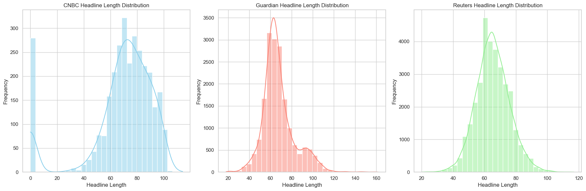
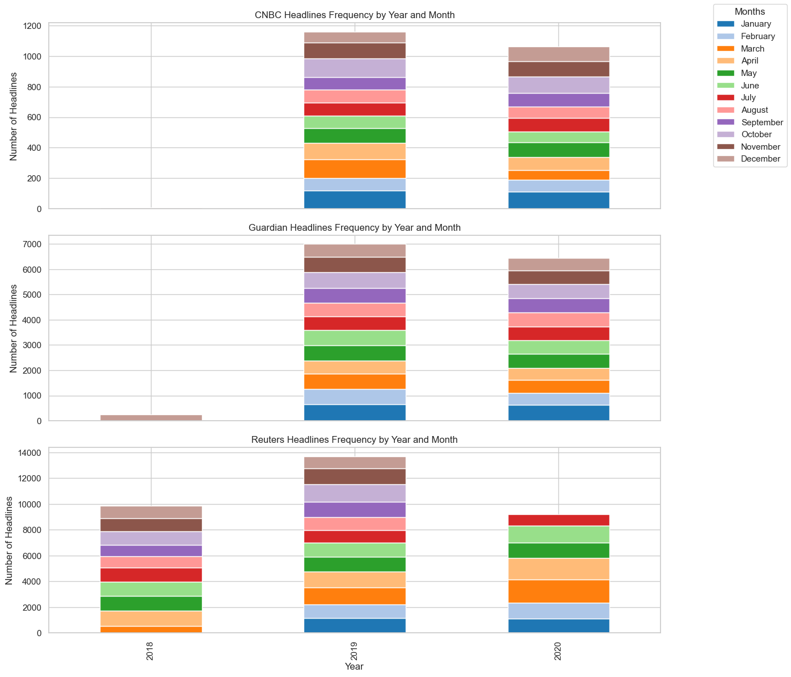
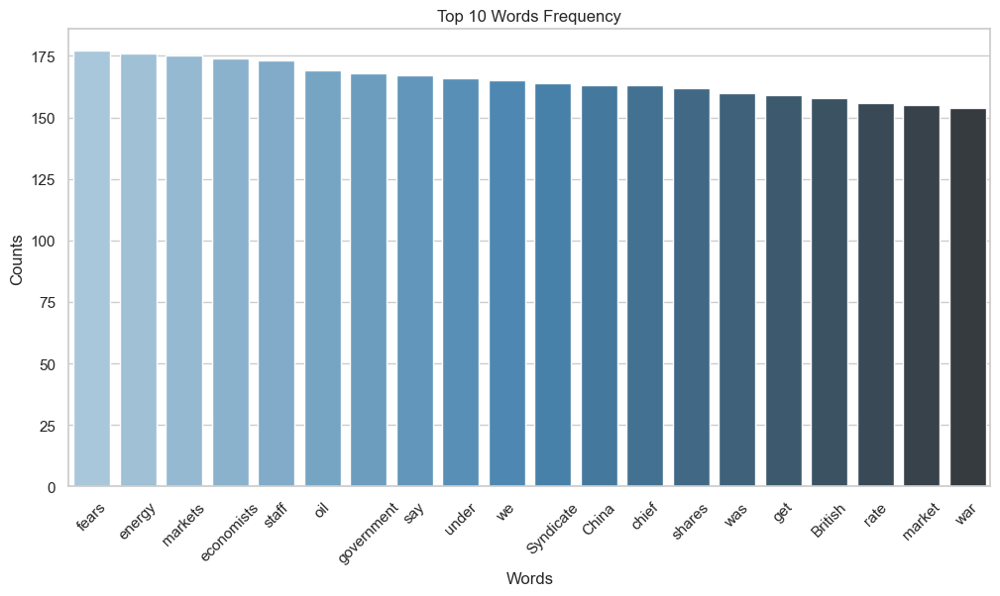
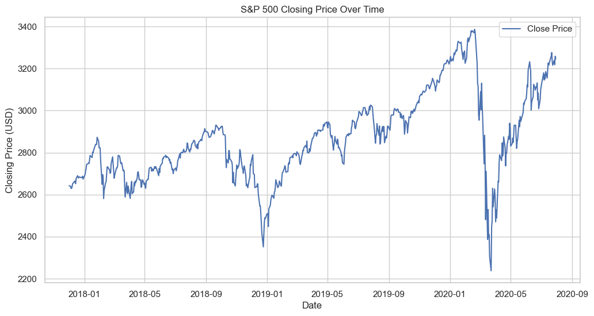

# CSE 151A Project Report
# The Impact of News on Stock Market Predictions: Analyzing and predicting S&P 500 with News Headlines

## Introduction
Stock trading, as a critical component of the modern economic framework, profoundly impacts almost every aspect of our daily lives. The stock market itself serves as a vital barometer of economic trends, 
reflecting the trajectories of companies, regions, nations, and even the global economy. Stock prices fluctuate every second, with international news often playing a significant role in these changes. 
In the past, people relied on newspapers the next day to access news, but today, information is transmitted instantaneously to electronic devices worldwide through the internet.

In this project, we aim to train a model capable of predicting the rise or fall of the S&P 500 index immediately upon receiving news headlines. 
This tool can empower individuals to make more informed financial decisions, even if they lack expertise in the relevant industry or region covered by the news. 
For this purpose, we collected daily news headlines from CNBC, The Guardian, and Reuters from 2018 to 2020, along with daily trading data for the S&P 500 during the same period.

### Exploratory Data Analysis (EDA)

#### News Headlines Dataset

We gathered a total of:
	•	2,800 headlines from CNBC,
	•	17,800 from The Guardian, and
	•	32,770 from Reuters.
Analysis of headline lengths revealed that most headlines range from 60-70 words, with maximum lengths of 100 words for CNBC and Reuters, and 120 words for The Guardian.

Monthly distribution of headlines shows a higher concentration of news published in the earlier months of each year, as depicted in the graphs.

Further analysis identified the most frequently used words in the headlines. A histogram of word occurrences revealed notable terms such as fears, energy, government, 
China, and shares, while common filler words (e.g., articles, prepositions, pronouns) were excluded from the visualization for clarity.

#### S&P 500 Trading Dataset

The S&P 500 dataset, spanning December 1, 2017, to July 31, 2020, includes 669 daily records with no missing values. The dataset contains columns for High, Low, Close, and Volume. Key summary statistics are as follows:
	•	Average prices: High (2883), Low (2849), and Close (2867),
	•	Standard deviations: approximately 200 points, indicating moderate volatility,
	•	Average daily trading volume: 3.97 billion shares, ranging from 1.3 billion to 9.05 billion shares, reflecting spikes in market activity during major events.

Normalization or standardization will be applied to handle the scale differences between price and volume data, ensuring consistency during analysis.

The graph of S&P 500 prices over the project period highlights a significant dip in early 2020, driven by the onset of the COVID-19 pandemic. This event likely influenced the predictive power of news headlines, as the pandemic triggered global market uncertainty and panic. While COVID-related news may dominate the model’s attention, it could skew the embeddings of other words due to its overwhelming impact during this period.

## Methods

## Results

## Discussion

This project explored predicting the S&P 500's daily movements using machine learning on news headlines and trading data. The process revealed valuable insights and challenges that shaped our understanding.

Initially, we believed news sentiment combined with market data would be a strong predictor. Early efforts, like the TFIDF-based model, set a baseline but highlighted the limitations of simple feature extraction. The Transformer classifier offered modest improvements, achieving a 59.2% test accuracy after tuning. However, the gains were incremental, suggesting the model struggled with the high noise and complexity inherent in financial data.

One major challenge was the dataset itself. Stock movements depend on a mix of news, macroeconomic factors, and investor behavior, making it difficult for any single model to perform well. Additionally, the binary classification approach, while straightforward, may have oversimplified the problem. A regression model could provide more nuanced predictions, reflecting the continuous nature of market changes.

Our results are moderately believable—they outperform random guessing but remain far from reliable for decision-making. This reflects both the unpredictable nature of financial markets and the limitations of current modeling approaches.

Looking ahead, integrating advanced techniques like LSTMs for time-series analysis or BERT for sentiment-focused tasks could improve outcomes. Rethinking the problem framework, such as combining classification with regression or using ensemble methods, might also better capture the complexity of the task.

## Conclusion

## Statement of Collaboration
- **Xueyan Shi**:

- **Satvik Sriram**:

- **Sunan Xu**:

- **Kelly**:
  - Collected and analyzed the S&P 500 stock data.
  - Conducted data preprocessing to ensure model readiness.
  - Built the LSTM model for Model 2, performed hyperparameter tuning, and compared it with the Transformer classifier.
  - Compiled the documentation and drafted the final report.

- **Kliment Ho**:

- **Qianjin Zhou**:

We collaboratively discussed the project topic and model approaches. Regularly reviewed and compared model results as a team to identify areas for improvement and achieve better performance.

--
## Milestone 4: Second Model + more

### Transformer Classifier
Generally throughout the different iterations of our Transformer model, we found that it finished fitting within the first 10 epochs. This could most likely be occuring do to our large batch sizes and how big the data is. Our best Transformer model is one where we implemented the following improvements: we did hyperparameter tuning to find the ideal number of heads, layers, etc, change the number of outputs in the final layer of the Transformer model from 2 to 1, and had no learning rate decay. This model obtained a test accuracy of 59.2% and a train accuracy of 69.8%. Although this is better than our first model, TFIDF, we feel that there is still room for improvement with other models.

**Note:** Please see the end of our [Project Notebook](project.ipynb) to see the final model's fitting graph, train vs. test error, and predictive stats on the test data.

### Conclusion
Overall our second model performed worse than our expectations. Althrough it beat out the first model, it was very marginal compared to the hyperparameter tuning that was done. Some improvements that can be done to this model is to possibly create and ensemble with a time series model and transform the problem into a regression problem. We believe that there is a lot of noise in the data to do a simple classification, so reworking the problem may utilize the model the best. These changes could improve the model; however, we believe that the improvements would be limited due to the nature of the model and the data itself. 

### Future Models
Another that we plan to look into are LSTMs. These types of models perform in both NLP tasks and time series tasks. Since our problem is heavily dependent on those two things, LSTMs could be the perfect model.
We have also already began working with BERT because it is bidirectional and it is specifically built for sentiment analysis. We believe that the combination of these facts along with attention can boost the accuracy on this dataset. 

**Things we did:**
New grouped dataset for the Transformer Classifier. [View Dataset](grouped_dataset.csv)

Transformer Classifier Model. [View Model](project.ipynb) (Under the Transformer Classifier header)
